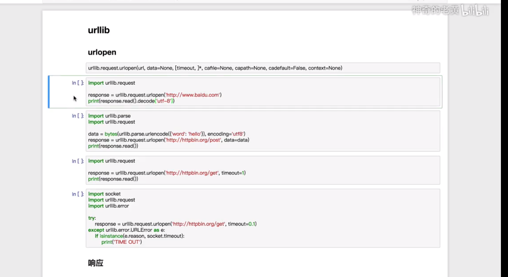

#### 什么是爬虫
* 请求网站并提取数据的自动化程序
#### 爬虫的基本流程
* 发起请求
* 获取响应的内容
* 解析内容
* 保存数据
#### 什么是request和response

#### 解析方式
* 直接处理
* json解析
* 正则表达式
* BeautifulSoup
* PuQuery
* xPath

### Urllib库详解
#### 什么是Urllib(Python内置的HTTP请求库)
|||
|--------------|-------------|
|urllib.request|请求模块|
|urllib.error|异常处理模块|
|urllib.parse|url解析模块|
|urllib.robotparser|robots.txt解析模块|

#### requests库
        import requests
        
        response=requests.get("https://www.baidu.com")
        print(type(response))
        print(response.status_code)
        print(type(response.text))
        print(response.text)
        print(response.cookies)
        
        # requests 各种请求
        response.post("http://httpbin.org/post")
        response.put("http://httpbin.org/put")
        response.delete("http://httpbin.org/delete")
        response.head("http://httpbin.org/get")
        response.options("http://httpbin.org/get")
#####  请求get请求
    import requests
    response=requests.get("http://httpbin.org/get")
    print(response.text)
    {
      "args": {}, 
      "headers": {
        "Accept": "*/*", 
        "Accept-Encoding": "gzip, deflate", 
        "Host": "httpbin.org", 
        "User-Agent": "python-requests/2.22.0", 
        "X-Amzn-Trace-Id": "Root=1-5e4d312a-3d2f74fcf3245cec7104df17"
      }, 
      "origin": "183.199.169.233", 
      "url": "http://httpbin.org/get"
    }

##### 带参数get请求
    import requests
    # 方法一
    response=requests.get("http://httpbin.org/get?name=germey&age=22")
    print(response.text)
    # 方法二
    data={
        'name':'germey',
        'age':22
    }
    response=requests.get('http://httpbin.org/get',params=data)
    print(response.text)
    {
      "args": {
        "age": "22", 
        "name": "germey"
      }, 
      "headers": {
        "Accept": "*/*", 
        "Accept-Encoding": "gzip, deflate", 
        "Host": "httpbin.org", 
        "User-Agent": "python-requests/2.22.0", 
        "X-Amzn-Trace-Id": "Root=1-5e4d3557-c375122b538bcbe042cd132e"
      }, 
      "origin": "183.199.169.233", 
      "url": "http://httpbin.org/get?name=germey&age=22"
    }

#### 解析json
    import requests
    import json
    
    response=requests.get("http://httpbin.org/get")
    print(response.json())
    print(json.loads(response.text))
    print(type(response.json()))
    '''
    {'args': {}, 'headers': {'Accept': '*/*', 'Accept-Encoding': 'gzip, deflate', 'Host': 'httpbin.org', 'User-Agent': 'python-requests/2.22.0', 'X-Amzn-Trace-Id': 'Root=1-5e4d3641-c05ab4b7ef58e3cf1c66ec49'}, 'origin': '183.199.169.233', 'url': 'http://httpbin.org/get'}
    {'args': {}, 'headers': {'Accept': '*/*', 'Accept-Encoding': 'gzip, deflate', 'Host': 'httpbin.org', 'User-Agent': 'python-requests/2.22.0', 'X-Amzn-Trace-Id': 'Root=1-5e4d3641-c05ab4b7ef58e3cf1c66ec49'}, 'origin': '183.199.169.233', 'url': 'http://httpbin.org/get'}
    <class 'dict'>
    '''
#### 获取二进制数据
    import requests
    
    response=requests.get('https://github.com/favicon.ico')
    print(type(response.text),type(response.content))
    print(response.text)
    print(response.content)
    '''
    <class 'str'> <class 'bytes'>
    :�������O                                L������                                      ������                                        ������!                                ������4                                @���8���          
    ��������333                                                ���t�������+R������t                                                                `������R����������                                                                    �������������\                                                                        G������������                                                                          ������������                                                                                ������������                                                                                ���������������                                                                            ������������%                                                                           ������������v                                                                        a������G������                                                                ������G+++������]                                                                I������+++    ������3                                                                ������         �����5            +*���                ���&            !�����             �����f    @@@b����������l+++    R�����                $$$��������������������������$$$                     ������������������������                             .����������������������.                                     ��������������������                                             $$$������������������$$$                                                         ��������������                                                                         +++G��������G+++                                                                                                                                                                                                                                                                                                                                                                                                                                                                                                                                                                                                                                                                                                                                                                                                                                                                                                                                                                                                                                                                                                        
    b'\x00\x00\x01\x00\x02\x00\x10\x10\x00\x00\x01\x00 \x00(\x05\x00\x00&\x00\x00\x00  \x00\x00\x01\x00 \x00(\x14\x00\x00N\x05\x00\x00(\x00\x00\x00\x10\x00\x00\x00 \x00\x00\x00\x01\x00 \x00\x00\x00\x00\x00\x00\x05\x00\x00\x00\x00\x00\x00\x00\x00\x00\x00\x00\x00\x00\x00\x00\x00\x00\x00\x00\x00\x00\x00\x00\x00\x00\x00\x00\x00\x00\x00\x00\x00\x00\x00\x11\x11\x13v\x13\x13\x13\xc5\x0e\x0e\x0e\x12\x00\x00\x00\x00\x00\x00\x00\x00\x0f\x0f\x0f\x11\x11\x11\x14\xb1\x13\x13\x13i\x00\x00\x00\x00\x00\x00\x00\x00\x00\x00\x00\x00\x00\x00\x00\x00\x00\x00\x00\x00\x00\x00\x00\x00\x00\x00\x00\x00\x14\x14\x14\x96\x13\x13\x14\xfc\x13\x13\x14\xed\x00\x00\x00\x19\x00\x00\x00\x00\x00\x00\x00\x00\x00\x00\x00\x18\x15\x15\x17\xff\x15\x15\x17\xff\x11\x11\x13\x85\x00\x00\x00\x00\x00\x00\x00\x00\x00\x00\x00\x00\x00\x00\x00\x00\x00\x00\x00\x00\x11\x11\x12\xc1\x13\x13\x14\xee\x11\x11\x11\x1e\x10\x10\x10\x10\x00\x00\x00\x00\x00\x00\x00\x00\x00\x00\x00\x00\x00\x00\x00\r\x13\x13\x14\xf5\x15\x15\x17\xff\x15\x15\x17\xff\x11\x11\x14\xaf\x00\x00\x00\x00\x00\x00\x00\x00\x00\x00\x00\x00\x14\x14\x14\x99\x15\x15\x17\xff\x06\x06\x11,\x0e\x0e\x0e\\\x0f\x0f\x0f\xc1\x0f\x0f\x0f"\x00\x00\x00\x00\x00\x00\x00\x00\x0f\x0f\x0f4\x10\x10\x10\xff\x15\x15\x17\xff\x15\x15\x17\xff\x15\x15\x17\xff\x14\x14\x14\x8f\x00\x00\x00\x00\x10\x10\x100\x0f\r\x0f\xff\x00\x00\x00\xf9\x01\x01\x01\xed\x02\x02\x02\xff\x02\x02\x02\xf6\x0e\x0e\x0e8\x00\x00\x00\x00\x00\x00\x00\x00\x08\x08\x08@\x02\x02\x02\xeb\x15\x15\x17\xff\x15\x15\x17\xff\x15\x15\x17\xff\x15\x15\x17\xff\x11\x11\x11-\x14\x14\x15\x9c\x14\x14\x15\xff\x01\x01\x01\xfc\x0f\x0f\x11\xfb\r\r\x11;\x00\x00\x00\x00\x00\x00\x00\x00\x00\x00\x00\x00\x00\x00\x00\x00\x00\x00\x00\x00\x00\x00\x00\x00\r\r\x12:\x13\x13\x14\xe7\x15\x15\x17\xff\x15\x15\x17\xff\x12\x12\x12\x9a\x13\x13\x13\xd9\x15\x15\x17\xff\x15\x15\x17\xff\x13\x13\x13O\x00\x00\x00\x00\x00\x00\x00\x00\x00\x00\x00\x00\x00\x00\x00\x00\x00\x00\x00\x00\x00\x00\x00\x00\x00\x00\x00\x00\x00\x00\x00\x00\x11\x11\x11L\x15\x15\x17\xff\x15\x15\x17\xff\x13\x13\x13\xda\x13\x13\x14\xf6\x15\x15\x17\xff\x14\x14\x14\xf0\x00\x00\x00\x02\x00\x00\x00\x00\x00\x00\x00\x00\x00\x00\x00\x00\x00\x00\x00\x00\x00\x00\x00\x00\x00\x00\x00\x00\x00\x00\x00\x00\x00\x00\x00\x00\x00\x00\x00\x02\x13\x13\x14\xf1\x15\x15\x17\xff\x13\x13\x14\xf6\x13\x13\x14\xf7\x15\x15\x17\xff\x14\x14\x14\xe1\x00\x00\x00\x00\x00\x00\x00\x00\x00\x00\x00\x00\x00\x00\x00\x00\x00\x00\x00\x00\x00\x00\x00\x00\x00\x00\x00\x00\x00\x00\x00\x00\x00\x00\x00\x00\x00\x00\x00\x00\x14\x14\x14\xe1\x15\x15\x17\xff\x13\x13\x14\xf7\x14\x14\x14\xde\x15\x15\x17\xff\x13\x13\x14\xf9\x0f\x0f\x0f!\x00\x00\x00\x00\x00\x00\x00\x00\x00\x00\x00\x00\x00\x00\x00\x00\x00\x00\x00\x00\x00\x00\x00\x00\x00\x00\x00\x00\x00\x00\x00\x00\x10\x10\x10\x1f\x13\x13\x14\xf8\x15\x15\x17\xff\x14\x14\x14\xde\x11\x11\x14\xa2\x15\x15\x17\xff\x15\x15\x17\xff\x0f\x0f\x0f4\x00\x00\x00\x00\x00\x00\x00\x00\x00\x00\x00\x00\x00\x00\x00\x00\x00\x00\x00\x00\x00\x00\x00\x00\x00\x00\x00\x00\x00\x00\x00\x00\x10\x10\x10@\x15\x15\x17\xff\x15\x15\x17\xff\x11\x11\x14\xa2\x0e\x0e\x0e8\x15\x15\x17\xff\x15\x15\x17\xff\x12\x12\x12\x98\x00\x00\x00\x00\x00\x00\x00\x0c\x00\x00\x00\n\x00\x00\x00\x00\x00\x00\x00\x00\x00\x00\x00\x0c\x00\x00\x00\x01\x00\x00\x00\x00\x12\x12\x12\x98\x15\x15\x17\xff\x15\x15\x17\xff\x0e\x0e\x0e8\x00\x00\x00\x00\x11\x11\x14\xa4\x15\x15\x17\xff\x11\x11\x12\xc1\x0e\x0e\x0e6\x00\x00\x00\x81\r\r\r\xdc\x12\x12\x14\xd8\x12\x12\x14\xd8\x13\x13\x14\xf7\x00\x00\x00t\x05\x05\x057\x11\x11\x12\xc1\x15\x15\x17\xff\x11\x11\x14\xa4\x00\x00\x00\x00\x00\x00\x00\x00\x00\x00\x00\x03\x13\x13\x13\xc6\x15\x15\x17\xff\x15\x15\x17\xff\x15\x15\x17\xff\x15\x15\x17\xff\x15\x15\x17\xff\x15\x15\x17\xff\x15\x15\x17\xff\x15\x15\x17\xff\x15\x15\x17\xff\x15\x15\x17\xff\x13\x13\x13\xc6\x00\x00\x00\x03\x00\x00\x00\x00\x00\x00\x00\x00\x00\x00\x00\x00\x00\x00\x00\x03\x11\x11\x14\xa2\x15\x15\x17\xff\x15\x15\x17\xff\x15\x15\x17\xff\x15\x15\x17\xff\x15\x15\x17\xff\x15\x15\x17\xff\x15\x15\x17\xff\x15\x15\x17\xff\x11\x11\x14\xa2\x00\x00\x00\x03\x00\x00\x00\x00\x00\x00\x00\x00\x00\x00\x00\x00\x00\x00\x00\x00\x00\x00\x00\x00\x00\x00\x00\x00\x10\x10\x10>\x13\x13\x13\x97\x13\x13\x13\xd9\x12\x12\x14\xf2\x12\x12\x14\xf2\x13\x13\x13\xd9\x13\x13\x13\x97\x10\x10\x10>\x00\x00\x00\x00\x00\x00\x00\x00\x00\x00\x00\x00\x00\x00\x00\x00\x00\x00\x00\x00\x00\x00\x00\x00\x00\x00\x00\x00\x00\x00\x00\x00\x00\x00\x00\x00\x00\x00\x00\x00\x00\x00\x00\x00\x00\x00\x00\x00\x00\x00\x00\x00\x00\x00\x00\x00\x00\x00\x00\x00\x00\x00\x00\x00\x00\x00\x00\x00\x00\x00\x00\x00\x00\x00\x00\x00\x00\x00\x00\x00\x00\x00\x00\x00\x00\x00\x00\x00\x00\x00\x00\x00\x00\x00\x00\x00\x00\x00\x00\x00\x00\x00\x00\x00\x00\x00\x00\x00\x00\x00\x00\x00\x00\x00\x00\x00\x00\x00\x00\x00\x00\x00\x00\x00\x00\x00\x00\x00\x00\x00\x00\x00\x00\x00\x00\x00\x00\x00\x00\x00\x00\x00\x00\x00\x00\x00\x00\x00\x00\x00\x00\x00\x00\x00\x00\x00\x00\x00\x00\x00\x00\x00\x00\x00\x00\x00\x00\x00\x00\x00\x00\x00\x00\x00\x00\x00\x00\x00\x00\x00\x00\x00\x00\x00\x00\x00\x00\x00\x00\x00\x00\x00\x00\x00\x00\x00\x00\x00\x00\x00\x00\x00\x00\x00\x00\x00\x00\x00\x00\x00\x00\x00\x00\x00\x00\x00\x00\x00\x00\x00\x00\x00\x00\x00\x00\x00\x00\x00\x00\x00\x00\x00\x00\x00\x00\x00\x00\x00\x00\x00\x00\x00\x00\x00\x00\x00\x00\x00\x00\x00\x00\x00\x00\x00\x00\x00\x00\x00\x00\x00\x00\x00\x00\x00\x00\x00\x00\x00\x00\x00\x00\x00(\x00\x00\x00 \x00\x00\x00@\x00\x00\x00\x01\x00 \x00\x00\x00\x00\x00\x00\x14\x00\x00\x00\x00\x00\x00\x00\x00\x00\x00\x00\x00\x00\x00\x00\x00\x00\x00\x00\x00\x00\x00\x00\x00\x00\x00\x00\x00\x00\x00\x00\x00\x00\x00\x00\x00\x00\x00\x00\x00\x00\x00\x00\x00\x00\x00\x00\x00\x00\x00\x00\x00\x00\x00\x00\x00\x00\x00\x15\x15+\x0c\x1e\x1e\x1e\x11\x00\x00\x00\x00\x00\x00\x00\x00\x00\x00\x00\x00\x00\x00\x00\x00\x00\x00\x00\x00\x00\x00\x00\x00\x00\x00\x00\x00\x00\x00\x00\x00\x1b\x1b\x1b\x1c$$$\x0e\x00\x00\x00\x00\x00\x00\x00\x00\x00\x00\x00\x00\x00\x00\x00\x00\x00\x00\x00\x00\x00\x00\x00\x00\x00\x00\x00\x00\x00\x00\x00\x00\x00\x00\x00\x00\x00\x00\x00\x00\x00\x00\x00\x00\x00\x00\x00\x00\x00\x00\x00\x00\x00\x00\x00\x00\x00\x00\x00\x00\x00\x00\x00\x00\x00\x00\x00\x00\x00\x00\x00\x00\x16\x16\x1d#\x17\x17\x18\x92\x15\x15\x17\xf1\x16\x16\x17\xf3@@@\x04\x00\x00\x00\x00\x00\x00\x00\x00\x00\x00\x00\x00\x00\x00\x00\x00\x00\x00\x00\x00\x00\x00\x00\x00\x00\x00\x00\x00\x16\x16\x18\xed\x16\x16\x17\xf3\x16\x16\x18\x95\x1c\x1c\x1c%\x00\x00\x00\x00\x00\x00\x00\x00\x00\x00\x00\x00\x00\x00\x00\x00\x00\x00\x00\x00\x00\x00\x00\x00\x00\x00\x00\x00\x00\x00\x00\x00\x00\x00\x00\x00\x00\x00\x00\x00\x00\x00\x00\x00\x00\x00\x00\x00\x00\x00\x00\x00\x00\x00\x00\x00$$$\x07\x16\x16\x18\x80\x16\x16\x18\xf8\x15\x15\x17\xff\x15\x15\x17\xff\x15\x15\x17\xff   \x08\x00\x00\x00\x00\x00\x00\x00\x00\x00\x00\x00\x00\x00\x00\x00\x00\x00\x00\x00\x00\x00\x00\x00\x00\x00\x00\x00\x00\x15\x15\x17\xfe\x15\x15\x17\xff\x15\x15\x17\xff\x16\x16\x18\xf9\x16\x16\x18\x82   \x08\x00\x00\x00\x00\x00\x00\x00\x00\x00\x00\x00\x00\x00\x00\x00\x00\x00\x00\x00\x00\x00\x00\x00\x00\x00\x00\x00\x00\x00\x00\x00\x00\x00\x00\x00\x00\x00\x00\x00\x00\x00\x00\x00\x00\x1b\x1b\x1b\x1c\x16\x16\x17\xd0\x15\x15\x17\xff\x15\x15\x17\xff\x15\x15\x17\xff\x15\x15\x17\xff\x15\x15\x17\xff+++\x06\x00\x00\x00\x00\x00\x00\x00\x00\x00\x00\x00\x00\x00\x00\x00\x00\x00\x00\x00\x00\x00\x00\x00\x00\x00\x00\x00\x00\x15\x15\x17\xfd\x15\x15\x17\xff\x15\x15\x17\xff\x15\x15\x17\xff\x15\x15\x17\xff\x16\x16\x17\xd2\x1a\x1a\x1a\x1e\x00\x00\x00\x00\x00\x00\x00\x00\x00\x00\x00\x00\x00\x00\x00\x00\x00\x00\x00\x00\x00\x00\x00\x00\x00\x00\x00\x00\x00\x00\x00\x00\x00\x00\x00\x00\x16\x16\x1b/\x15\x15\x17\xe6\x15\x15\x17\xff\x15\x15\x17\xfc\x16\x16\x18\xb8\x16\x16\x18t\x16\x16\x19g\x16\x16\x18~UUU\x03\x00\x00\x00\x00\x00\x00\x00\x00\x00\x00\x00\x00\x00\x00\x00\x00\x00\x00\x00\x00\x00\x00\x00\x00\x00\x00\x00\x00\x15\x15\x17\xfc\x15\x15\x17\xff\x15\x15\x17\xff\x15\x15\x17\xff\x15\x15\x17\xff\x15\x15\x17\xff\x15\x15\x17\xe6\x16\x16\x1b/\x00\x00\x00\x00\x00\x00\x00\x00\x00\x00\x00\x00\x00\x00\x00\x00\x00\x00\x00\x00\x00\x00\x00\x00\x00\x00\x00\x00\x1a\x1a\x1a\x1d\x15\x15\x17\xe6\x15\x15\x17\xff\x15\x15\x17\xfc\x18\x18\x18I\x00\x00\x00\x00\x00\x00\x00\x00\x00\x00\x00\x00\x00\x00\x00\x00\x00\x00\x00\x00\x00\x00\x00\x00\x00\x00\x00\x00\x00\x00\x00\x00\x00\x00\x00\x00\x00\x00\x00\x00\x00\x00\x00\x00\x00\x00\x00\x00\x15\x15\x17\xfb\x15\x15\x17\xff\x15\x15\x17\xff\x15\x15\x17\xff\x15\x15\x17\xff\x15\x15\x17\xff\x15\x15\x17\xff\x15\x15\x17\xe6\x1a\x1a\x1a\x1d\x00\x00\x00\x00\x00\x00\x00\x00\x00\x00\x00\x00\x00\x00\x00\x00\x00\x00\x00\x00$$$\x07\x16\x16\x17\xd1\x15\x15\x17\xff\x15\x15\x17\xff\x15\x15\x18\x9d\x00\x00\x00\x00\x15\x15 \x18\x16\x16\x18s\x15\x15\x17\x90\x17\x17\x19f$$$\x07\x00\x00\x00\x00\x00\x00\x00\x00\x00\x00\x00\x00\x00\x00\x00\x00\x00\x00\x00\x00\x00\x00\x00\x00\x1c\x1c\x1c\x12\x15\x15\x17\xff\x15\x15\x17\xff\x15\x15\x17\xff\x15\x15\x17\xff\x15\x15\x17\xff\x15\x15\x17\xff\x15\x15\x17\xff\x15\x15\x17\xff\x16\x16\x17\xd1$$$\x07\x00\x00\x00\x00\x00\x00\x00\x00\x00\x00\x00\x00\x00\x00\x00\x00\x16\x16\x18\x81\x15\x15\x17\xff\x15\x15\x17\xff\x15\x15\x17\xf1\x1b\x1b\x1b\x1c\x1c\x1c\x1c%\x16\x16\x18\xeb\x15\x15\x17\xff\x15\x15\x17\xff\x15\x15\x17\xff\x17\x17\x1aN\x00\x00\x00\x00\x00\x00\x00\x00\x00\x00\x00\x00\x00\x00\x00\x00\x00\x00\x00\x00\x00\x00\x00\x00\x18\x18\x18@\x15\x15\x17\xff\x15\x15\x17\xff\x15\x15\x17\xff\x15\x15\x17\xff\x15\x15\x17\xff\x15\x15\x17\xff\x15\x15\x17\xff\x15\x15\x17\xff\x15\x15\x17\xff\x16\x16\x18\x80\x00\x00\x00\x00\x00\x00\x00\x00\x00\x00\x00\x00\x15\x15\x1c$\x16\x16\x18\xf9\x15\x15\x17\xff\x15\x15\x18\xee\x16\x16\x1aE\x15\x15+\x0c\x16\x16\x17\xcf\x15\x15\x17\xff\x15\x15\x17\xff\x15\x15\x17\xff\x15\x15\x17\xff\x16\x16\x17\xc4\x80\x80\x80\x02\x00\x00\x00\x00\x00\x00\x00\x00\x00\x00\x00\x00\x00\x00\x00\x00\x00\x00\x00\x00\x15\x15\x18\xbf\x15\x15\x17\xff\x15\x15\x17\xff\x15\x15\x17\xff\x15\x15\x17\xff\x15\x15\x17\xff\x15\x15\x17\xff\x15\x15\x17\xff\x15\x15\x17\xff\x15\x15\x17\xff\x16\x16\x18\xf8\x16\x16\x1d#\x00\x00\x00\x00\x00\x00\x00\x00\x16\x16\x18\x94\x15\x15\x17\xff\x15\x15\x17\xff\x16\x16\x17\x8e\x17\x17\x1aZ\x16\x16\x17\xd1\x15\x15\x17\xff\x15\x15\x17\xff\x15\x15\x18\xe2\x16\x16\x18\x80\x16\x16\x1aE\x1c\x1c\x1c\x12\x00\x00\x00\x00\x00\x00\x00\x00\x00\x00\x00\x00\x00\x00\x00\x00\x00\x00\x00\x00\x00\x00\x00\x00"""\x0f\x17\x17\x17B\x17\x17\x19{\x16\x16\x17\xdb\x15\x15\x17\xff\x15\x15\x17\xff\x15\x15\x17\xff\x15\x15\x17\xff\x15\x15\x17\xff\x15\x15\x17\xff\x15\x15\x17\xff\x17\x17\x18\x93\x00\x00\x00\x00\'\'\'\r\x15\x15\x17\xf2\x15\x15\x17\xff\x15\x15\x17\xff\x15\x15\x17\xff\x15\x15\x17\xff\x15\x15\x17\xff\x15\x15\x17\xfe\x16\x16\x18\x82333\x05\x00\x00\x00\x00\x00\x00\x00\x00\x00\x00\x00\x00\x00\x00\x00\x00\x00\x00\x00\x00\x00\x00\x00\x00\x00\x00\x00\x00\x00\x00\x00\x00\x00\x00\x00\x00\x00\x00\x00\x00\x00\x00\x00\x00\x00\x00\x00\x00\x80\x80\x80\x02\x16\x16\x18t\x15\x15\x17\xfc\x15\x15\x17\xff\x15\x15\x17\xff\x15\x15\x17\xff\x15\x15\x17\xff\x15\x15\x17\xff\x15\x15\x17\xf2\x15\x15+\x0c\x16\x16\x19R\x15\x15\x17\xff\x15\x15\x17\xff\x15\x15\x17\xff\x15\x15\x17\xff\x15\x15\x17\xff\x15\x15\x17\xff\x16\x16\x18t\x00\x00\x00\x00\x00\x00\x00\x00\x00\x00\x00\x00\x00\x00\x00\x00\x00\x00\x00\x00\x00\x00\x00\x00\x00\x00\x00\x00\x00\x00\x00\x00\x00\x00\x00\x00\x00\x00\x00\x00\x00\x00\x00\x00\x00\x00\x00\x00\x00\x00\x00\x00\x00\x00\x00\x00\x00\x00\x00\x00\x00\x00\x00\x00\x15\x15\x18`\x15\x15\x17\xff\x15\x15\x17\xff\x15\x15\x17\xff\x15\x15\x17\xff\x15\x15\x17\xff\x15\x15\x17\xff\x16\x16\x19R\x15\x15\x19\x91\x15\x15\x17\xff\x15\x15\x17\xff\x15\x15\x17\xff\x15\x15\x17\xff\x15\x15\x17\xff\x15\x15\x18\xca\xff\xff\xff\x01\x00\x00\x00\x00\x00\x00\x00\x00\x00\x00\x00\x00\x00\x00\x00\x00\x00\x00\x00\x00\x00\x00\x00\x00\x00\x00\x00\x00\x00\x00\x00\x00\x00\x00\x00\x00\x00\x00\x00\x00\x00\x00\x00\x00\x00\x00\x00\x00\x00\x00\x00\x00\x00\x00\x00\x00\x00\x00\x00\x00\x00\x00\x00\x00\x00\x00\x00\x00\x16\x16\x18\xb7\x15\x15\x17\xff\x15\x15\x17\xff\x15\x15\x17\xff\x15\x15\x17\xff\x15\x15\x17\xff\x15\x15\x19\x91\x16\x16\x18\xc9\x15\x15\x17\xff\x15\x15\x17\xff\x15\x15\x17\xff\x15\x15\x17\xff\x15\x15\x17\xff\x16\x16\x19\\\x00\x00\x00\x00\x00\x00\x00\x00\x00\x00\x00\x00\x00\x00\x00\x00\x00\x00\x00\x00\x00\x00\x00\x00\x00\x00\x00\x00\x00\x00\x00\x00\x00\x00\x00\x00\x00\x00\x00\x00\x00\x00\x00\x00\x00\x00\x00\x00\x00\x00\x00\x00\x00\x00\x00\x00\x00\x00\x00\x00\x00\x00\x00\x00\x00\x00\x00\x00\x00\x00\x00\x00\x16\x16\x19G\x15\x15\x17\xff\x15\x15\x17\xff\x15\x15\x17\xff\x15\x15\x17\xff\x15\x15\x17\xff\x16\x16\x18\xc8\x16\x16\x18\xe1\x15\x15\x17\xff\x15\x15\x17\xff\x15\x15\x17\xff\x15\x15\x17\xff\x15\x15\x17\xff\x17\x17\x17\x16\x00\x00\x00\x00\x00\x00\x00\x00\x00\x00\x00\x00\x00\x00\x00\x00\x00\x00\x00\x00\x00\x00\x00\x00\x00\x00\x00\x00\x00\x00\x00\x00\x00\x00\x00\x00\x00\x00\x00\x00\x00\x00\x00\x00\x00\x00\x00\x00\x00\x00\x00\x00\x00\x00\x00\x00\x00\x00\x00\x00\x00\x00\x00\x00\x00\x00\x00\x00\x00\x00\x00\x00   \x08\x16\x16\x18\xf8\x15\x15\x17\xff\x15\x15\x17\xff\x15\x15\x17\xff\x15\x15\x17\xff\x16\x16\x18\xe0\x16\x16\x18\xf5\x15\x15\x17\xff\x15\x15\x17\xff\x15\x15\x17\xff\x15\x15\x17\xff\x15\x15\x17\xf2\x00\x00\x00\x00\x00\x00\x00\x00\x00\x00\x00\x00\x00\x00\x00\x00\x00\x00\x00\x00\x00\x00\x00\x00\x00\x00\x00\x00\x00\x00\x00\x00\x00\x00\x00\x00\x00\x00\x00\x00\x00\x00\x00\x00\x00\x00\x00\x00\x00\x00\x00\x00\x00\x00\x00\x00\x00\x00\x00\x00\x00\x00\x00\x00\x00\x00\x00\x00\x00\x00\x00\x00\x00\x00\x00\x00\x00\x00\x00\x00\x16\x16\x18\xde\x15\x15\x17\xff\x15\x15\x17\xff\x15\x15\x17\xff\x15\x15\x17\xff\x16\x16\x18\xf5\x16\x16\x17\xf3\x15\x15\x17\xff\x15\x15\x17\xff\x15\x15\x17\xff\x15\x15\x17\xff\x16\x16\x18\xde\x00\x00\x00\x00\x00\x00\x00\x00\x00\x00\x00\x00\x00\x00\x00\x00\x00\x00\x00\x00\x00\x00\x00\x00\x00\x00\x00\x00\x00\x00\x00\x00\x00\x00\x00\x00\x00\x00\x00\x00\x00\x00\x00\x00\x00\x00\x00\x00\x00\x00\x00\x00\x00\x00\x00\x00\x00\x00\x00\x00\x00\x00\x00\x00\x00\x00\x00\x00\x00\x00\x00\x00\x00\x00\x00\x00\x00\x00\x00\x00\x15\x15\x18\xca\x15\x15\x17\xff\x15\x15\x17\xff\x15\x15\x17\xff\x15\x15\x17\xff\x16\x16\x17\xf3\x15\x15\x18\xd9\x15\x15\x17\xff\x15\x15\x17\xff\x15\x15\x17\xff\x15\x15\x17\xff\x16\x16\x18\xf4\xff\xff\xff\x01\x00\x00\x00\x00\x00\x00\x00\x00\x00\x00\x00\x00\x00\x00\x00\x00\x00\x00\x00\x00\x00\x00\x00\x00\x00\x00\x00\x00\x00\x00\x00\x00\x00\x00\x00\x00\x00\x00\x00\x00\x00\x00\x00\x00\x00\x00\x00\x00\x00\x00\x00\x00\x00\x00\x00\x00\x00\x00\x00\x00\x00\x00\x00\x00\x00\x00\x00\x00\x00\x00\x00\x00\x00\x00\x00\x00\x16\x16\x18\xe1\x15\x15\x17\xff\x15\x15\x17\xff\x15\x15\x17\xff\x15\x15\x17\xff\x15\x15\x18\xd9\x15\x15\x18\xbf\x15\x15\x17\xff\x15\x15\x17\xff\x15\x15\x17\xff\x15\x15\x17\xff\x15\x15\x17\xff\x1c\x1c\x1c%\x00\x00\x00\x00\x00\x00\x00\x00\x00\x00\x00\x00\x00\x00\x00\x00\x00\x00\x00\x00\x00\x00\x00\x00\x00\x00\x00\x00\x00\x00\x00\x00\x00\x00\x00\x00\x00\x00\x00\x00\x00\x00\x00\x00\x00\x00\x00\x00\x00\x00\x00\x00\x00\x00\x00\x00\x00\x00\x00\x00\x00\x00\x00\x00\x00\x00\x00\x00\x00\x00\x00\x00   \x10\x15\x15\x17\xff\x15\x15\x17\xff\x15\x15\x17\xff\x15\x15\x17\xff\x15\x15\x17\xff\x15\x15\x18\xbf\x16\x16\x18\x95\x15\x15\x17\xff\x15\x15\x17\xff\x15\x15\x17\xff\x15\x15\x17\xff\x15\x15\x17\xff\x16\x16\x18v\x00\x00\x00\x00\x00\x00\x00\x00\x00\x00\x00\x00\x00\x00\x00\x00\x00\x00\x00\x00\x00\x00\x00\x00\x00\x00\x00\x00\x00\x00\x00\x00\x00\x00\x00\x00\x00\x00\x00\x00\x00\x00\x00\x00\x00\x00\x00\x00\x00\x00\x00\x00\x00\x00\x00\x00\x00\x00\x00\x00\x00\x00\x00\x00\x00\x00\x00\x00\x00\x00\x00\x00\x15\x15\x18a\x15\x15\x17\xff\x15\x15\x17\xff\x15\x15\x17\xff\x15\x15\x17\xff\x15\x15\x17\xff\x16\x16\x18\x95\x16\x16\x19G\x15\x15\x17\xff\x15\x15\x17\xff\x15\x15\x17\xff\x15\x15\x17\xff\x15\x15\x17\xff\x16\x16\x18\xf4\x19\x19\x19\x1f\x00\x00\x00\x00\x00\x00\x00\x00\x00\x00\x00\x00\x00\x00\x00\x00\x00\x00\x00\x00\x00\x00\x00\x00\x00\x00\x00\x00\x00\x00\x00\x00\x00\x00\x00\x00\x00\x00\x00\x00\x00\x00\x00\x00\x00\x00\x00\x00\x00\x00\x00\x00\x00\x00\x00\x00\x00\x00\x00\x00\x00\x00\x00\x00\x1b\x1b\x1b\x13\x16\x16\x18\xeb\x15\x15\x17\xff\x15\x15\x17\xff\x15\x15\x17\xff\x15\x15\x17\xff\x15\x15\x17\xff\x16\x16\x19G+++\x06\x15\x15\x17\xf1\x15\x15\x17\xff\x15\x15\x17\xff\x15\x15\x17\xff\x15\x15\x17\xff\x15\x15\x17\xff\x16\x16\x19]\x00\x00\x00\x00\x00\x00\x00\x00\x00\x00\x00\x00\x00\x00\x00\x00\x00\x00\x00\x00\x00\x00\x00\x00\x00\x00\x00\x00\x00\x00\x00\x00\x00\x00\x00\x00\x00\x00\x00\x00\x00\x00\x00\x00\x00\x00\x00\x00\x00\x00\x00\x00\x00\x00\x00\x00\x00\x00\x00\x00\x00\x00\x00\x00\x18\x18\x18I\x15\x15\x17\xff\x15\x15\x17\xff\x15\x15\x17\xff\x15\x15\x17\xff\x15\x15\x17\xff\x15\x15\x17\xf1+++\x06\x00\x00\x00\x00\x16\x16\x18\x97\x15\x15\x17\xff\x15\x15\x17\xff\x15\x15\x17\xff\x15\x15\x17\xff\x15\x15\x17\xff\x19\x19\x193\x00\x00\x00\x00\x00\x00\x00\x00\x00\x00\x00\x00\x00\x00\x00\x00\x00\x00\x00\x00\x00\x00\x00\x00\x00\x00\x00\x00\x00\x00\x00\x00\x00\x00\x00\x00\x00\x00\x00\x00\x00\x00\x00\x00\x00\x00\x00\x00\x00\x00\x00\x00\x00\x00\x00\x00\x00\x00\x00\x00\x00\x00\x00\x00\x1a\x1a\x1a\x1e\x15\x15\x17\xff\x15\x15\x17\xff\x15\x15\x17\xff\x15\x15\x17\xff\x15\x15\x17\xff\x16\x16\x18\x97\x00\x00\x00\x00\x00\x00\x00\x00\x15\x15 \x18\x16\x16\x18\xf4\x15\x15\x17\xff\x15\x15\x17\xff\x15\x15\x17\xff\x15\x15\x17\xff\x18\x18\x185\x00\x00\x00\x00\x00\x00\x00\x00\x00\x00\x00\x00\x15\x15+\x0c\x18\x18\x18*\x80\x80\x80\x02\x00\x00\x00\x00\x00\x00\x00\x00\x00\x00\x00\x00\x00\x00\x00\x00\xff\xff\xff\x01\x1b\x1b\x1b&\x1e\x1e\x1e\x11\x00\x00\x00\x00\x00\x00\x00\x00\x00\x00\x00\x00\x17\x17\x17!\x15\x15\x17\xff\x15\x15\x17\xff\x15\x15\x17\xff\x15\x15\x17\xff\x16\x16\x18\xf4\x15\x15 \x18\x00\x00\x00\x00\x00\x00\x00\x00\x00\x00\x00\x00\x16\x16\x18\x82\x15\x15\x17\xff\x15\x15\x17\xff\x15\x15\x17\xff\x15\x15\x17\xff\x17\x17\x19f\x00\x00\x00\x00@@@\x04\x17\x17\x17b\x16\x16\x17\xe7\x15\x15\x17\xff\x16\x16\x17\xf3\x16\x16\x17\xd2\x15\x15\x18\xc1\x15\x15\x18\xc0\x16\x16\x17\xd1\x15\x15\x17\xf0\x15\x15\x17\xff\x16\x16\x18\xed\x15\x15\x18l+++\x06\x00\x00\x00\x00\x16\x16\x19R\x15\x15\x17\xff\x15\x15\x17\xff\x15\x15\x17\xff\x15\x15\x17\xff\x16\x16\x18\x82\x00\x00\x00\x00\x00\x00\x00\x00\x00\x00\x00\x00\x00\x00\x00\x00$$$\x07\x16\x16\x18\xc8\x15\x15\x17\xff\x15\x15\x17\xff\x15\x15\x17\xff\x15\x15\x18\xd6\x15\x15\x18\xa8\x16\x16\x18\xec\x15\x15\x17\xff\x15\x15\x17\xff\x15\x15\x17\xff\x15\x15\x17\xff\x15\x15\x17\xff\x15\x15\x17\xff\x15\x15\x17\xff\x15\x15\x17\xff\x15\x15\x17\xff\x15\x15\x17\xff\x15\x15\x17\xff\x15\x15\x17\xff\x15\x15\x17\xef\x15\x15\x18\xaa\x15\x15\x18\xcd\x15\x15\x17\xff\x15\x15\x17\xff\x15\x15\x17\xff\x16\x16\x18\xc8$$$\x07\x00\x00\x00\x00\x00\x00\x00\x00\x00\x00\x00\x00\x00\x00\x00\x00\x00\x00\x00\x00\x15\x15 \x18\x15\x15\x18\xe3\x15\x15\x17\xff\x15\x15\x17\xff\x15\x15\x17\xff\x15\x15\x17\xff\x15\x15\x17\xff\x15\x15\x17\xff\x15\x15\x17\xff\x15\x15\x17\xff\x15\x15\x17\xff\x15\x15\x17\xff\x15\x15\x17\xff\x15\x15\x17\xff\x15\x15\x17\xff\x15\x15\x17\xff\x15\x15\x17\xff\x15\x15\x17\xff\x15\x15\x17\xff\x15\x15\x17\xff\x15\x15\x17\xff\x15\x15\x17\xff\x15\x15\x17\xff\x15\x15\x17\xff\x15\x15\x18\xe3\x15\x15 \x18\x00\x00\x00\x00\x00\x00\x00\x00\x00\x00\x00\x00\x00\x00\x00\x00\x00\x00\x00\x00\x00\x00\x00\x00\x00\x00\x00\x00\x16\x16\x1c.\x15\x15\x18\xe3\x15\x15\x17\xff\x15\x15\x17\xff\x15\x15\x17\xff\x15\x15\x17\xff\x15\x15\x17\xff\x15\x15\x17\xff\x15\x15\x17\xff\x15\x15\x17\xff\x15\x15\x17\xff\x15\x15\x17\xff\x15\x15\x17\xff\x15\x15\x17\xff\x15\x15\x17\xff\x15\x15\x17\xff\x15\x15\x17\xff\x15\x15\x17\xff\x15\x15\x17\xff\x15\x15\x17\xff\x15\x15\x17\xff\x15\x15\x17\xff\x15\x15\x18\xe3\x16\x16\x1c.\x00\x00\x00\x00\x00\x00\x00\x00\x00\x00\x00\x00\x00\x00\x00\x00\x00\x00\x00\x00\x00\x00\x00\x00\x00\x00\x00\x00\x00\x00\x00\x00\x00\x00\x00\x00\x15\x15 \x18\x16\x16\x18\xc8\x15\x15\x17\xff\x15\x15\x17\xff\x15\x15\x17\xff\x15\x15\x17\xff\x15\x15\x17\xff\x15\x15\x17\xff\x15\x15\x17\xff\x15\x15\x17\xff\x15\x15\x17\xff\x15\x15\x17\xff\x15\x15\x17\xff\x15\x15\x17\xff\x15\x15\x17\xff\x15\x15\x17\xff\x15\x15\x17\xff\x15\x15\x17\xff\x15\x15\x17\xff\x15\x15\x17\xff\x16\x16\x18\xc8\x15\x15 \x18\x00\x00\x00\x00\x00\x00\x00\x00\x00\x00\x00\x00\x00\x00\x00\x00\x00\x00\x00\x00\x00\x00\x00\x00\x00\x00\x00\x00\x00\x00\x00\x00\x00\x00\x00\x00\x00\x00\x00\x00\x00\x00\x00\x00$$$\x07\x16\x16\x18\x82\x16\x16\x18\xf4\x15\x15\x17\xff\x15\x15\x17\xff\x15\x15\x17\xff\x15\x15\x17\xff\x15\x15\x17\xff\x15\x15\x17\xff\x15\x15\x17\xff\x15\x15\x17\xff\x15\x15\x17\xff\x15\x15\x17\xff\x15\x15\x17\xff\x15\x15\x17\xff\x15\x15\x17\xff\x15\x15\x17\xff\x16\x16\x18\xf4\x16\x16\x18\x82$$$\x07\x00\x00\x00\x00\x00\x00\x00\x00\x00\x00\x00\x00\x00\x00\x00\x00\x00\x00\x00\x00\x00\x00\x00\x00\x00\x00\x00\x00\x00\x00\x00\x00\x00\x00\x00\x00\x00\x00\x00\x00\x00\x00\x00\x00\x00\x00\x00\x00\x00\x00\x00\x00\x00\x00\x00\x00\x15\x15 \x18\x16\x16\x18\x97\x15\x15\x17\xf1\x15\x15\x17\xff\x15\x15\x17\xff\x15\x15\x17\xff\x15\x15\x17\xff\x15\x15\x17\xff\x15\x15\x17\xff\x15\x15\x17\xff\x15\x15\x17\xff\x15\x15\x17\xff\x15\x15\x17\xff\x15\x15\x17\xf1\x16\x16\x18\x97\x15\x15 \x18\x00\x00\x00\x00\x00\x00\x00\x00\x00\x00\x00\x00\x00\x00\x00\x00\x00\x00\x00\x00\x00\x00\x00\x00\x00\x00\x00\x00\x00\x00\x00\x00\x00\x00\x00\x00\x00\x00\x00\x00\x00\x00\x00\x00\x00\x00\x00\x00\x00\x00\x00\x00\x00\x00\x00\x00\x00\x00\x00\x00\x00\x00\x00\x00\x00\x00\x00\x00\x00\x00\x00\x00+++\x06\x16\x16\x19G\x16\x16\x18\x95\x15\x15\x18\xbf\x15\x15\x18\xd9\x16\x16\x17\xf3\x16\x16\x17\xf3\x15\x15\x18\xd9\x15\x15\x18\xbf\x16\x16\x18\x95\x16\x16\x19G+++\x06\x00\x00\x00\x00\x00\x00\x00\x00\x00\x00\x00\x00\x00\x00\x00\x00\x00\x00\x00\x00\x00\x00\x00\x00\x00\x00\x00\x00\x00\x00\x00\x00\x00\x00\x00\x00\x00\x00\x00\x00\x00\x00\x00\x00\x00\x00\x00\x00\x00\x00\x00\x00\x00\x00\x00\x00\x00\x00\x00\x00\x00\x00\x00\x00\x00\x00\x00\x00\x00\x00\x00\x00\x00\x00\x00\x00\x00\x00\x00\x00\x00\x00\x00\x00\x00\x00\x00\x00\x00\x00\x00\x00\x00\x00\x00\x00\x00\x00\x00\x00\x00\x00\x00\x00\x00\x00\x00\x00\x00\x00\x00\x00\x00\x00\x00\x00\x00\x00\x00\x00\x00\x00\x00\x00\x00\x00\x00\x00\x00\x00\x00\x00\x00\x00\x00\x00\x00\x00\x00\x00\x00\x00\x00\x00\x00\x00\x00\x00\x00\x00\x00\x00\x00\x00\x00\x00\x00\x00\x00\x00\x00\x00\x00\x00\x00\x00\x00\x00\x00\x00\x00\x00\x00\x00\x00\x00\x00\x00\x00\x00\x00\x00\x00\x00\x00\x00\x00\x00\x00\x00\x00\x00\x00\x00\x00\x00\x00\x00\x00\x00\x00\x00\x00\x00\x00\x00\x00\x00\x00\x00\x00\x00\x00\x00\x00\x00\x00\x00\x00\x00\x00\x00\x00\x00\x00\x00\x00\x00\x00\x00\x00\x00\x00\x00\x00\x00\x00\x00\x00\x00\x00\x00\x00\x00\x00\x00\x00\x00\x00\x00\x00\x00\x00\x00\x00\x00\x00\x00\x00\x00\x00\x00\x00\x00\x00\x00\x00\x00\x00\x00\x00\x00\x00\x00\x00\x00\x00\x00\x00\x00\x00\x00\x00\x00\x00\x00\x00\x00\x00\x00\x00\x00\x00\x00\x00\x00\x00\x00\x00\x00\x00\x00\x00\x00\x00\x00\x00\x00\x00\x00\x00\x00\x00\x00\x00\x00\x00\x00\x00\x00\x00\x00\x00\x00\x00\x00\x00\x00\x00\x00\x00\x00\x00\x00\x00\x00\x00\x00\x00\x00\x00\x00\x00\x00\x00\x00\x00\x00\x00\x00\x00\x00\x00\x00\x00\x00\x00\x00\x00\x00\x00\x00\x00\x00\x00\x00\x00\x00\x00\x00\x00\x00\x00\x00\x00\x00\x00\x00\x00\x00\x00\x00\x00\x00\x00\x00\x00\x00\x00\x00\x00\x00\x00\x00\x00\x00\x00\x00\x00\x00\x00\x00\x00\x00\x00\x00\x00\x00\x00\x00\x00\x00\x00\x00\x00\x00\x00\x00\x00\x00\x00\x00\x00\x00\x00\x00\x00\x00\x00\x00\x00\x00\x00\x00\x00\x00\x00\x00\x00\x00\x00\x00\x00\x00\x00\x00\x00\x00\x00\x00\x00\x00\x00\x00\x00\x00\x00\x00\x00\x00\x00\x00\x00\x00\x00\x00\x00\x00\x00\x00\x00\x00\x00\x00\x00\x00\x00\x00\x00\x00\x00\x00\x00\x00\x00\x00\x00\x00\x00\x00\x00\x00\x00\x00\x00\x00\x00\x00\x00\x00\x00\x00\x00\x00\x00\x00\x00\x00\x00\x00\x00\x00\x00\x00\x00\x00\x00\x00\x00\x00\x00\x00\x00\x00\x00\x00\x00\x00\x00\x00\x00\x00\x00\x00\x00\x00\x00\x00\x00\x00\x00\x00\x00\x00\x00\x00\x00\x00\x00\x00\x00\x00\x00\x00\x00\x00\x00\x00\x00\x00\x00\x00\x00\x00\x00\x00\x00\x00\x00\x00\x00\x00\x00\x00\x00\x00\x00\x00\x00\x00\x00\x00\x00\x00\x00\x00\x00\x00\x00\x00\x00\x00\x00\x00\x00\x00\x00\x00\x00\x00\x00\x00\x00\x00\x00\x00\x00\x00\x00\x00\x00\x00\x00\x00\x00\x00\x00\x00\x00\x00\x00\x00\x00\x00\x00\x00\x00\x00\x00\x00\x00\x00\x00\x00\x00\x00\x00\x00\x00\x00\x00\x00\x00\x00\x00\x00\x00\x00\x00\x00\x00\x00\x00\x00\x00\x00\x00\x00\x00\x00\x00\x00\x00\x00\x00\x00\x00\x00\x00\x00\x00\x00\x00\x00\x00\x00\x00\x00\x00\x00\x00\x00\x00\x00\x00\x00\x00\x00\x00\x00\x00\x00\x00\x00\x00\x00\x00\x00\x00\x00\x00\x00\x00\x00\x00\x00\x00\x00\x00\x00\x00\x00\x00\x00\x00\x00\x00\x00\x00\x00\x00\x00\x00\x00\x00\x00\x00\x00\x00\x00\x00\x00\x00\x00\x00\x00\x00\x00\x00\x00\x00\x00\x00\x00\x00\x00\x00\x00\x00\x00\x00\x00\x00\x00\x00\x00\x00\x00\x00\x00\x00\x00\x00\x00\x00\x00\x00\x00\x00\x00\x00\x00\x00\x00\x00\x00\x00\x00\x00\x00\x00\x00\x00\x00\x00\x00\x00\x00\x00\x00\x00\x00\x00\x00\x00\x00\x00\x00\x00\x00\x00\x00\x00\x00\x00\x00\x00\x00\x00\x00\x00\x00\x00\x00\x00\x00\x00\x00\x00\x00\x00\x00\x00\x00\x00\x00\x00\x00\x00\x00\x00\x00\x00\x00\x00\x00\x00\x00\x00\x00\x00\x00\x00\x00\x00\x00\x00\x00\x00\x00\x00\x00\x00\x00\x00\x00\x00\x00\x00\x00\x00\x00\x00\x00\x00\x00\x00\x00\x00\x00\x00\x00\x00\x00\x00\x00\x00\x00\x00\x00\x00\x00\x00\x00\x00\x00\x00\x00\x00\x00\x00\x00\x00\x00\x00\x00\x00\x00\x00\x00\x00\x00\x00\x00\x00\x00\x00\x00\x00\x00\x00\x00\x00\x00\x00\x00\x00\x00\x00\x00\x00\x00\x00\x00\x00\x00\x00\x00\x00\x00\x00\x00\x00\x00\x00\x00\x00\x00\x00\x00\x00\x00\x00\x00\x00\x00\x00\x00\x00\x00\x00\x00\x00\x00\x00\x00\x00\x00\x00\x00\x00\x00\x00\x00\x00\x00\x00\x00\x00\x00\x00\x00\x00\x00\x00\x00\x00\x00\x00\x00\x00\x00\x00\x00\x00\x00\x00\x00\x00\x00\x00\x00\x00\x00\x00\x00\x00\x00\x00\x00\x00\x00\x00\x00\x00\x00\x00\x00\x00\x00\x00\x00\x00\x00\x00\x00\x00\x00\x00\x00\x00\x00\x00\x00\x00\x00\x00\x00\x00\x00\x00\x00\x00\x00\x00\x00\x00\x00\x00\x00\x00\x00\x00\x00\x00\x00\x00\x00\x00\x00\x00\x00\x00\x00\x00\x00\x00\x00\x00\x00\x00\x00\x00\x00'
    
    '''
    # 写入图片
    with open('INimgs//favicon.ico','wb') as f:
        f.write(response.content)
        f.close()
        
#### 常用的headers
    user_agent = [
        "Mozilla/5.0 (Macintosh; U; Intel Mac OS X 10_6_8; en-us) AppleWebKit/534.50 (KHTML, like Gecko) Version/5.1 Safari/534.50",
        "Mozilla/5.0 (Windows; U; Windows NT 6.1; en-us) AppleWebKit/534.50 (KHTML, like Gecko) Version/5.1 Safari/534.50",
        "Mozilla/5.0 (Windows NT 10.0; WOW64; rv:38.0) Gecko/20100101 Firefox/38.0",
        "Mozilla/5.0 (Windows NT 10.0; WOW64; Trident/7.0; .NET4.0C; .NET4.0E; .NET CLR 2.0.50727; .NET CLR 3.0.30729; .NET CLR 3.5.30729; InfoPath.3; rv:11.0) like Gecko",
        "Mozilla/5.0 (compatible; MSIE 9.0; Windows NT 6.1; Trident/5.0)",
        "Mozilla/4.0 (compatible; MSIE 8.0; Windows NT 6.0; Trident/4.0)",
        "Mozilla/4.0 (compatible; MSIE 7.0; Windows NT 6.0)",
        "Mozilla/4.0 (compatible; MSIE 6.0; Windows NT 5.1)",
        "Mozilla/5.0 (Macintosh; Intel Mac OS X 10.6; rv:2.0.1) Gecko/20100101 Firefox/4.0.1",
        "Mozilla/5.0 (Windows NT 6.1; rv:2.0.1) Gecko/20100101 Firefox/4.0.1",
        "Opera/9.80 (Macintosh; Intel Mac OS X 10.6.8; U; en) Presto/2.8.131 Version/11.11",
        "Opera/9.80 (Windows NT 6.1; U; en) Presto/2.8.131 Version/11.11",
        "Mozilla/5.0 (Macintosh; Intel Mac OS X 10_7_0) AppleWebKit/535.11 (KHTML, like Gecko) Chrome/17.0.963.56 Safari/535.11",
        "Mozilla/4.0 (compatible; MSIE 7.0; Windows NT 5.1; Maxthon 2.0)",
        "Mozilla/4.0 (compatible; MSIE 7.0; Windows NT 5.1; TencentTraveler 4.0)",
        "Mozilla/4.0 (compatible; MSIE 7.0; Windows NT 5.1)",
        "Mozilla/4.0 (compatible; MSIE 7.0; Windows NT 5.1; The World)",
        "Mozilla/4.0 (compatible; MSIE 7.0; Windows NT 5.1; Trident/4.0; SE 2.X MetaSr 1.0; SE 2.X MetaSr 1.0; .NET CLR 2.0.50727; SE 2.X MetaSr 1.0)",
        "Mozilla/4.0 (compatible; MSIE 7.0; Windows NT 5.1; 360SE)",
        "Mozilla/4.0 (compatible; MSIE 7.0; Windows NT 5.1; Avant Browser)",
        "Mozilla/4.0 (compatible; MSIE 7.0; Windows NT 5.1)",
        "Mozilla/5.0 (iPhone; U; CPU iPhone OS 4_3_3 like Mac OS X; en-us) AppleWebKit/533.17.9 (KHTML, like Gecko) Version/5.0.2 Mobile/8J2 Safari/6533.18.5",
        "Mozilla/5.0 (iPod; U; CPU iPhone OS 4_3_3 like Mac OS X; en-us) AppleWebKit/533.17.9 (KHTML, like Gecko) Version/5.0.2 Mobile/8J2 Safari/6533.18.5",
        "Mozilla/5.0 (iPad; U; CPU OS 4_3_3 like Mac OS X; en-us) AppleWebKit/533.17.9 (KHTML, like Gecko) Version/5.0.2 Mobile/8J2 Safari/6533.18.5",
        "Mozilla/5.0 (Linux; U; Android 2.3.7; en-us; Nexus One Build/FRF91) AppleWebKit/533.1 (KHTML, like Gecko) Version/4.0 Mobile Safari/533.1",
        "MQQBrowser/26 Mozilla/5.0 (Linux; U; Android 2.3.7; zh-cn; MB200 Build/GRJ22; CyanogenMod-7) AppleWebKit/533.1 (KHTML, like Gecko) Version/4.0 Mobile Safari/533.1",
        "Opera/9.80 (Android 2.3.4; Linux; Opera Mobi/build-1107180945; U; en-GB) Presto/2.8.149 Version/11.10",
        "Mozilla/5.0 (Linux; U; Android 3.0; en-us; Xoom Build/HRI39) AppleWebKit/534.13 (KHTML, like Gecko) Version/4.0 Safari/534.13",
        "Mozilla/5.0 (BlackBerry; U; BlackBerry 9800; en) AppleWebKit/534.1+ (KHTML, like Gecko) Version/6.0.0.337 Mobile Safari/534.1+",
        "Mozilla/5.0 (hp-tablet; Linux; hpwOS/3.0.0; U; en-US) AppleWebKit/534.6 (KHTML, like Gecko) wOSBrowser/233.70 Safari/534.6 TouchPad/1.0",
        "Mozilla/5.0 (SymbianOS/9.4; Series60/5.0 NokiaN97-1/20.0.019; Profile/MIDP-2.1 Configuration/CLDC-1.1) AppleWebKit/525 (KHTML, like Gecko) BrowserNG/7.1.18124",
        "Mozilla/5.0 (compatible; MSIE 9.0; Windows Phone OS 7.5; Trident/5.0; IEMobile/9.0; HTC; Titan)",
        "UCWEB7.0.2.37/28/999",
        "NOKIA5700/ UCWEB7.0.2.37/28/999",
        "Openwave/ UCWEB7.0.2.37/28/999",
        "Mozilla/4.0 (compatible; MSIE 6.0; ) Opera/UCWEB7.0.2.37/28/999",
        # iPhone 6：
        "Mozilla/6.0 (iPhone; CPU iPhone OS 8_0 like Mac OS X) AppleWebKit/536.26 (KHTML, like Gecko) Version/8.0 Mobile/10A5376e Safari/8536.25",
    
    ]
    
    headers = {'User-Agent': random.choice(user_agent)}
#### 添加headers
        '''
        import requests
        response=requests.get("https://www.zhihu.com/explore")
        print(response.text)
        
        
        <html>
        <head><title>400 Bad Request</title></head>
        <body bgcolor="white">
        
<h1>400 Bad Request</h1>

        

openresty

        </body>
        </html>
        不加headers可能网站直接拒之门外
        '''
        import requests
        headers={
            'User-Agent':"Mozilla/5.0 (Windows NT 6.1; rv:2.0.1) Gecko/20100101 Firefox/4.0.1"
        }
        response=requests.get("https://www.zhihu.com/explore",headers=headers)
        print(response.text)

##### 结果        
        <!DOCTYPE html>
        <html>
          <head>
            <meta charset="utf-8" />
            <meta name="viewport" content="width=device-width,initial-scale=1,maximum-scale=1" />
            <meta name="google-site-verification" content="FTeR0c8arOPKh8c5DYh_9uu98_zJbaWw53J-Sch9MTg" />
            <link rel="shortcut icon" type="image/x-icon" href="https://static.zhihu.com/static/favicon.ico" />
            
              </head>
              <body>
                

                  

                    

                      
                    

                  

                

                

                  

                    
                  

                  
你正在使用的浏览器版本过低，将不能正常浏览和使用知乎。

                  

                    <a href="https://www.microsoft.com/zh-cn/download/internet-explorer.aspx" class="CompatibilityBrowsers-item">
                      

                        
                      

                      
升级 IE 浏览器

                      

                    </a>
                    <a href="http://www.google.com/chrome/" class="CompatibilityBrowsers-item">
                      

                        
                      

                      
使用 Google Chrome 浏览器

                    </a>
                

              </body>
            </html>
            
#### reponse属性
    import requests
    headers={
        'User-Agent':"Mozilla/5.0 (Windows NT 6.1; rv:2.0.1) Gecko/20100101 Firefox/4.0.1"
    }
    response=requests.get("http://www.jianshu.com",headers=headers)
    print(type(response.status_code),response.status_code)
    print(type(response.headers),response.headers)
    print(type(response.cookies),response.cookies)
    print(type(response.url),response.url)
    print(type(response.history),response.history)
    '''
    <class 'int'> 403
    <class 'requests.structures.CaseInsensitiveDict'> {'Server': 'Tengine', 'Date': 'Wed, 19 Feb 2020 14:02:59 GMT', 'Content-Type': 'text/html', 'Transfer-Encoding': 'chunked', 'Connection': 'keep-alive', 'Vary': 'Accept-Encoding', 'Strict-Transport-Security': 'max-age=31536000; includeSubDomains; preload', 'Content-Encoding': 'gzip'}
    <class 'requests.cookies.RequestsCookieJar'> <RequestsCookieJar[]>
    <class 'str'> https://www.jianshu.com/
    <class 'list'> [<Response [301]>]
    #加入headers
    <class 'int'> 200
    <class 'requests.structures.CaseInsensitiveDict'> {'Server': 'Tengine', 'Date': 'Wed, 19 Feb 2020 14:04:14 GMT', 'Content-Type': 'text/html; charset=utf-8', 'Transfer-Encoding': 'chunked', 'Connection': 'keep-alive', 'Vary': 'Accept-Encoding', 'X-Frame-Options': 'SAMEORIGIN', 'X-XSS-Protection': '1; mode=block', 'X-Content-Type-Options': 'nosniff', 'ETag': 'W/"31ccc67b6553a2980ed88e0f4e73b4e0"', 'Cache-Control': 'max-age=0, private, must-revalidate', 'Set-Cookie': 'locale=zh-CN; path=/', 'X-Request-Id': 'eb289464-63b9-4ce0-a51a-c4e52963fb75', 'X-Runtime': '0.008718', 'Strict-Transport-Security': 'max-age=31536000; includeSubDomains; preload', 'Content-Encoding': 'gzip'}
    <class 'requests.cookies.RequestsCookieJar'> <RequestsCookieJar[<Cookie locale=zh-CN for www.jianshu.com/>]>
    <class 'str'> https://www.jianshu.com/
    <class 'list'> [<Response [301]>]
    ''' 
  
#### 状态码的判断  
    import requests
    
    # response=requests.get("http://www.jianshu.com")
    # exit() if response.status_code==requests.codes.ok else print("Request Successfully")
    #Request Successfully
    
    response=requests.get("http://www.jianshu,com/hello.html")
    exit() if response.status_code==200 else print("404 Not Found")

### Requests高级操作
#### 文件上穿
import requests

files={'file':open('INimgs//favicon.ico','rb')}
response=requests.post("http://httpbin.org/post",files=files)
print(response.text)
'''
{
  "args": {}, 
  "data": "", 
  "files": {
    "file": "data:application/octet-stream;base64,AAABAAIAEBAAAAEAIAAoBQAAJgAAACAgAAABACAAKBQAAE4FAAAoAAAAEAAAACAAAAABACAAAAAAAAAFAAAAAAAAAAAAAAAAAAAAAAAAAAAAAAAAAAAAAAAAAAAAABERE3YTExPFDg4OEgAAAAAAAAAADw8PERERFLETExNpAAAAAAAAAAAAAAAAAAAAAAAAAAAAAAAAAAAAABQUFJYTExT8ExMU7QAAABkAAAAAAAAAAAAAABgVFRf/FRUX/xERE4UAAAAAAAAAAAAAAAAAAAAAAAAAABEREsETExTuERERHhAQEBAAAAAAAAAAAAAAAAAAAAANExMU9RUVF/8VFRf/EREUrwAAAAAAAAAAAAAAABQUFJkVFRf/BgYRLA4ODlwPDw/BDw8PIgAAAAAAAAAADw8PNBAQEP8VFRf/FRUX/xUVF/8UFBSPAAAAABAQEDAPDQ//AAAA+QEBAe0CAgL/AgIC9g4ODjgAAAAAAAAAAAgICEACAgLrFRUX/xUVF/8VFRf/FRUX/xERES0UFBWcFBQV/wEBAfwPDxH7DQ0ROwAAAAAAAAAAAAAAAAAAAAAAAAAAAAAAAA0NEjoTExTnFRUX/xUVF/8SEhKaExMT2RUVF/8VFRf/ExMTTwAAAAAAAAAAAAAAAAAAAAAAAAAAAAAAAAAAAAAAAAAAERERTBUVF/8VFRf/ExMT2hMTFPYVFRf/FBQU8AAAAAIAAAAAAAAAAAAAAAAAAAAAAAAAAAAAAAAAAAAAAAAAAAAAAAITExTxFRUX/xMTFPYTExT3FRUX/xQUFOEAAAAAAAAAAAAAAAAAAAAAAAAAAAAAAAAAAAAAAAAAAAAAAAAAAAAAFBQU4RUVF/8TExT3FBQU3hUVF/8TExT5Dw8PIQAAAAAAAAAAAAAAAAAAAAAAAAAAAAAAAAAAAAAAAAAAEBAQHxMTFPgVFRf/FBQU3hERFKIVFRf/FRUX/w8PDzQAAAAAAAAAAAAAAAAAAAAAAAAAAAAAAAAAAAAAAAAAABAQEEAVFRf/FRUX/xERFKIODg44FRUX/xUVF/8SEhKYAAAAAAAAAAwAAAAKAAAAAAAAAAAAAAAMAAAAAQAAAAASEhKYFRUX/xUVF/8ODg44AAAAABERFKQVFRf/ERESwQ4ODjYAAACBDQ0N3BISFNgSEhTYExMU9wAAAHQFBQU3ERESwRUVF/8RERSkAAAAAAAAAAAAAAADExMTxhUVF/8VFRf/FRUX/xUVF/8VFRf/FRUX/xUVF/8VFRf/FRUX/xUVF/8TExPGAAAAAwAAAAAAAAAAAAAAAAAAAAMRERSiFRUX/xUVF/8VFRf/FRUX/xUVF/8VFRf/FRUX/xUVF/8RERSiAAAAAwAAAAAAAAAAAAAAAAAAAAAAAAAAAAAAABAQED4TExOXExMT2RISFPISEhTyExMT2RMTE5cQEBA+AAAAAAAAAAAAAAAAAAAAAAAAAAAAAAAAAAAAAAAAAAAAAAAAAAAAAAAAAAAAAAAAAAAAAAAAAAAAAAAAAAAAAAAAAAAAAAAAAAAAAAAAAAAAAAAAAAAAAAAAAAAAAAAAAAAAAAAAAAAAAAAAAAAAAAAAAAAAAAAAAAAAAAAAAAAAAAAAAAAAAAAAAAAAAAAAAAAAAAAAAAAAAAAAAAAAAAAAAAAAAAAAAAAAAAAAAAAAAAAAAAAAAAAAAAAAAAAAAAAAAAAAAAAAAAAAAAAAAAAAAAAAAAAAAAAAAAAAAAAAAAAAAAAAAAAAAAAAAAAAAAAAAAAAAAAAAAAAAAAAAAAAAAAAAAAAAAAAAAAAAAAoAAAAIAAAAEAAAAABACAAAAAAAAAUAAAAAAAAAAAAAAAAAAAAAAAAAAAAAAAAAAAAAAAAAAAAAAAAAAAAAAAAAAAAAAAAAAAAAAAAAAAAABUVKwweHh4RAAAAAAAAAAAAAAAAAAAAAAAAAAAAAAAAAAAAAAAAAAAbGxscJCQkDgAAAAAAAAAAAAAAAAAAAAAAAAAAAAAAAAAAAAAAAAAAAAAAAAAAAAAAAAAAAAAAAAAAAAAAAAAAAAAAAAAAAAAAAAAAAAAAABYWHSMXFxiSFRUX8RYWF/NAQEAEAAAAAAAAAAAAAAAAAAAAAAAAAAAAAAAAAAAAABYWGO0WFhfzFhYYlRwcHCUAAAAAAAAAAAAAAAAAAAAAAAAAAAAAAAAAAAAAAAAAAAAAAAAAAAAAAAAAAAAAAAAAAAAAAAAAACQkJAcWFhiAFhYY+BUVF/8VFRf/FRUX/yAgIAgAAAAAAAAAAAAAAAAAAAAAAAAAAAAAAAAAAAAAFRUX/hUVF/8VFRf/FhYY+RYWGIIgICAIAAAAAAAAAAAAAAAAAAAAAAAAAAAAAAAAAAAAAAAAAAAAAAAAAAAAAAAAAAAbGxscFhYX0BUVF/8VFRf/FRUX/xUVF/8VFRf/KysrBgAAAAAAAAAAAAAAAAAAAAAAAAAAAAAAAAAAAAAVFRf9FRUX/xUVF/8VFRf/FRUX/xYWF9IaGhoeAAAAAAAAAAAAAAAAAAAAAAAAAAAAAAAAAAAAAAAAAAAAAAAAFhYbLxUVF+YVFRf/FRUX/BYWGLgWFhh0FhYZZxYWGH5VVVUDAAAAAAAAAAAAAAAAAAAAAAAAAAAAAAAAAAAAABUVF/wVFRf/FRUX/xUVF/8VFRf/FRUX/xUVF+YWFhsvAAAAAAAAAAAAAAAAAAAAAAAAAAAAAAAAAAAAABoaGh0VFRfmFRUX/xUVF/wYGBhJAAAAAAAAAAAAAAAAAAAAAAAAAAAAAAAAAAAAAAAAAAAAAAAAAAAAAAAAAAAAAAAAFRUX+xUVF/8VFRf/FRUX/xUVF/8VFRf/FRUX/xUVF+YaGhodAAAAAAAAAAAAAAAAAAAAAAAAAAAkJCQHFhYX0RUVF/8VFRf/FRUYnQAAAAAVFSAYFhYYcxUVF5AXFxlmJCQkBwAAAAAAAAAAAAAAAAAAAAAAAAAAAAAAABwcHBIVFRf/FRUX/xUVF/8VFRf/FRUX/xUVF/8VFRf/FRUX/xYWF9EkJCQHAAAAAAAAAAAAAAAAAAAAABYWGIEVFRf/FRUX/xUVF/EbGxscHBwcJRYWGOsVFRf/FRUX/xUVF/8XFxpOAAAAAAAAAAAAAAAAAAAAAAAAAAAAAAAAGBgYQBUVF/8VFRf/FRUX/xUVF/8VFRf/FRUX/xUVF/8VFRf/FRUX/xYWGIAAAAAAAAAAAAAAAAAVFRwkFhYY+RUVF/8VFRjuFhYaRRUVKwwWFhfPFRUX/xUVF/8VFRf/FRUX/xYWF8SAgIACAAAAAAAAAAAAAAAAAAAAAAAAAAAVFRi/FRUX/xUVF/8VFRf/FRUX/xUVF/8VFRf/FRUX/xUVF/8VFRf/FhYY+BYWHSMAAAAAAAAAABYWGJQVFRf/FRUX/xYWF44XFxpaFhYX0RUVF/8VFRf/FRUY4hYWGIAWFhpFHBwcEgAAAAAAAAAAAAAAAAAAAAAAAAAAAAAAACIiIg8XFxdCFxcZexYWF9sVFRf/FRUX/xUVF/8VFRf/FRUX/xUVF/8VFRf/FxcYkwAAAAAnJycNFRUX8hUVF/8VFRf/FRUX/xUVF/8VFRf/FRUX/hYWGIIzMzMFAAAAAAAAAAAAAAAAAAAAAAAAAAAAAAAAAAAAAAAAAAAAAAAAAAAAAAAAAAAAAAAAgICAAhYWGHQVFRf8FRUX/xUVF/8VFRf/FRUX/xUVF/8VFRfyFRUrDBYWGVIVFRf/FRUX/xUVF/8VFRf/FRUX/xUVF/8WFhh0AAAAAAAAAAAAAAAAAAAAAAAAAAAAAAAAAAAAAAAAAAAAAAAAAAAAAAAAAAAAAAAAAAAAAAAAAAAAAAAAAAAAABUVGGAVFRf/FRUX/xUVF/8VFRf/FRUX/xUVF/8WFhlSFRUZkRUVF/8VFRf/FRUX/xUVF/8VFRf/FRUYyv///wEAAAAAAAAAAAAAAAAAAAAAAAAAAAAAAAAAAAAAAAAAAAAAAAAAAAAAAAAAAAAAAAAAAAAAAAAAAAAAAAAAAAAAAAAAABYWGLcVFRf/FRUX/xUVF/8VFRf/FRUX/xUVGZEWFhjJFRUX/xUVF/8VFRf/FRUX/xUVF/8WFhlcAAAAAAAAAAAAAAAAAAAAAAAAAAAAAAAAAAAAAAAAAAAAAAAAAAAAAAAAAAAAAAAAAAAAAAAAAAAAAAAAAAAAAAAAAAAAAAAAFhYZRxUVF/8VFRf/FRUX/xUVF/8VFRf/FhYYyBYWGOEVFRf/FRUX/xUVF/8VFRf/FRUX/xcXFxYAAAAAAAAAAAAAAAAAAAAAAAAAAAAAAAAAAAAAAAAAAAAAAAAAAAAAAAAAAAAAAAAAAAAAAAAAAAAAAAAAAAAAAAAAAAAAAAAgICAIFhYY+BUVF/8VFRf/FRUX/xUVF/8WFhjgFhYY9RUVF/8VFRf/FRUX/xUVF/8VFRfyAAAAAAAAAAAAAAAAAAAAAAAAAAAAAAAAAAAAAAAAAAAAAAAAAAAAAAAAAAAAAAAAAAAAAAAAAAAAAAAAAAAAAAAAAAAAAAAAAAAAAAAAAAAWFhjeFRUX/xUVF/8VFRf/FRUX/xYWGPUWFhfzFRUX/xUVF/8VFRf/FRUX/xYWGN4AAAAAAAAAAAAAAAAAAAAAAAAAAAAAAAAAAAAAAAAAAAAAAAAAAAAAAAAAAAAAAAAAAAAAAAAAAAAAAAAAAAAAAAAAAAAAAAAAAAAAAAAAABUVGMoVFRf/FRUX/xUVF/8VFRf/FhYX8xUVGNkVFRf/FRUX/xUVF/8VFRf/FhYY9P///wEAAAAAAAAAAAAAAAAAAAAAAAAAAAAAAAAAAAAAAAAAAAAAAAAAAAAAAAAAAAAAAAAAAAAAAAAAAAAAAAAAAAAAAAAAAAAAAAAAAAAAFhYY4RUVF/8VFRf/FRUX/xUVF/8VFRjZFRUYvxUVF/8VFRf/FRUX/xUVF/8VFRf/HBwcJQAAAAAAAAAAAAAAAAAAAAAAAAAAAAAAAAAAAAAAAAAAAAAAAAAAAAAAAAAAAAAAAAAAAAAAAAAAAAAAAAAAAAAAAAAAAAAAACAgIBAVFRf/FRUX/xUVF/8VFRf/FRUX/xUVGL8WFhiVFRUX/xUVF/8VFRf/FRUX/xUVF/8WFhh2AAAAAAAAAAAAAAAAAAAAAAAAAAAAAAAAAAAAAAAAAAAAAAAAAAAAAAAAAAAAAAAAAAAAAAAAAAAAAAAAAAAAAAAAAAAAAAAAFRUYYRUVF/8VFRf/FRUX/xUVF/8VFRf/FhYYlRYWGUcVFRf/FRUX/xUVF/8VFRf/FRUX/xYWGPQZGRkfAAAAAAAAAAAAAAAAAAAAAAAAAAAAAAAAAAAAAAAAAAAAAAAAAAAAAAAAAAAAAAAAAAAAAAAAAAAAAAAAAAAAABsbGxMWFhjrFRUX/xUVF/8VFRf/FRUX/xUVF/8WFhlHKysrBhUVF/EVFRf/FRUX/xUVF/8VFRf/FRUX/xYWGV0AAAAAAAAAAAAAAAAAAAAAAAAAAAAAAAAAAAAAAAAAAAAAAAAAAAAAAAAAAAAAAAAAAAAAAAAAAAAAAAAAAAAAGBgYSRUVF/8VFRf/FRUX/xUVF/8VFRf/FRUX8SsrKwYAAAAAFhYYlxUVF/8VFRf/FRUX/xUVF/8VFRf/GRkZMwAAAAAAAAAAAAAAAAAAAAAAAAAAAAAAAAAAAAAAAAAAAAAAAAAAAAAAAAAAAAAAAAAAAAAAAAAAAAAAAAAAAAAaGhoeFRUX/xUVF/8VFRf/FRUX/xUVF/8WFhiXAAAAAAAAAAAVFSAYFhYY9BUVF/8VFRf/FRUX/xUVF/8YGBg1AAAAAAAAAAAAAAAAFRUrDBgYGCqAgIACAAAAAAAAAAAAAAAAAAAAAP///wEbGxsmHh4eEQAAAAAAAAAAAAAAABcXFyEVFRf/FRUX/xUVF/8VFRf/FhYY9BUVIBgAAAAAAAAAAAAAAAAWFhiCFRUX/xUVF/8VFRf/FRUX/xcXGWYAAAAAQEBABBcXF2IWFhfnFRUX/xYWF/MWFhfSFRUYwRUVGMAWFhfRFRUX8BUVF/8WFhjtFRUYbCsrKwYAAAAAFhYZUhUVF/8VFRf/FRUX/xUVF/8WFhiCAAAAAAAAAAAAAAAAAAAAACQkJAcWFhjIFRUX/xUVF/8VFRf/FRUY1hUVGKgWFhjsFRUX/xUVF/8VFRf/FRUX/xUVF/8VFRf/FRUX/xUVF/8VFRf/FRUX/xUVF/8VFRf/FRUX7xUVGKoVFRjNFRUX/xUVF/8VFRf/FhYYyCQkJAcAAAAAAAAAAAAAAAAAAAAAAAAAABUVIBgVFRjjFRUX/xUVF/8VFRf/FRUX/xUVF/8VFRf/FRUX/xUVF/8VFRf/FRUX/xUVF/8VFRf/FRUX/xUVF/8VFRf/FRUX/xUVF/8VFRf/FRUX/xUVF/8VFRf/FRUX/xUVGOMVFSAYAAAAAAAAAAAAAAAAAAAAAAAAAAAAAAAAAAAAABYWHC4VFRjjFRUX/xUVF/8VFRf/FRUX/xUVF/8VFRf/FRUX/xUVF/8VFRf/FRUX/xUVF/8VFRf/FRUX/xUVF/8VFRf/FRUX/xUVF/8VFRf/FRUX/xUVF/8VFRjjFhYcLgAAAAAAAAAAAAAAAAAAAAAAAAAAAAAAAAAAAAAAAAAAAAAAABUVIBgWFhjIFRUX/xUVF/8VFRf/FRUX/xUVF/8VFRf/FRUX/xUVF/8VFRf/FRUX/xUVF/8VFRf/FRUX/xUVF/8VFRf/FRUX/xUVF/8VFRf/FhYYyBUVIBgAAAAAAAAAAAAAAAAAAAAAAAAAAAAAAAAAAAAAAAAAAAAAAAAAAAAAAAAAACQkJAcWFhiCFhYY9BUVF/8VFRf/FRUX/xUVF/8VFRf/FRUX/xUVF/8VFRf/FRUX/xUVF/8VFRf/FRUX/xUVF/8VFRf/FhYY9BYWGIIkJCQHAAAAAAAAAAAAAAAAAAAAAAAAAAAAAAAAAAAAAAAAAAAAAAAAAAAAAAAAAAAAAAAAAAAAAAAAAAAVFSAYFhYYlxUVF/EVFRf/FRUX/xUVF/8VFRf/FRUX/xUVF/8VFRf/FRUX/xUVF/8VFRf/FRUX8RYWGJcVFSAYAAAAAAAAAAAAAAAAAAAAAAAAAAAAAAAAAAAAAAAAAAAAAAAAAAAAAAAAAAAAAAAAAAAAAAAAAAAAAAAAAAAAAAAAAAAAAAAAKysrBhYWGUcWFhiVFRUYvxUVGNkWFhfzFhYX8xUVGNkVFRi/FhYYlRYWGUcrKysGAAAAAAAAAAAAAAAAAAAAAAAAAAAAAAAAAAAAAAAAAAAAAAAAAAAAAAAAAAAAAAAAAAAAAAAAAAAAAAAAAAAAAAAAAAAAAAAAAAAAAAAAAAAAAAAAAAAAAAAAAAAAAAAAAAAAAAAAAAAAAAAAAAAAAAAAAAAAAAAAAAAAAAAAAAAAAAAAAAAAAAAAAAAAAAAAAAAAAAAAAAAAAAAAAAAAAAAAAAAAAAAAAAAAAAAAAAAAAAAAAAAAAAAAAAAAAAAAAAAAAAAAAAAAAAAAAAAAAAAAAAAAAAAAAAAAAAAAAAAAAAAAAAAAAAAAAAAAAAAAAAAAAAAAAAAAAAAAAAAAAAAAAAAAAAAAAAAAAAAAAAAAAAAAAAAAAAAAAAAAAAAAAAAAAAAAAAAAAAAAAAAAAAAAAAAAAAAAAAAAAAAAAAAAAAAAAAAAAAAAAAAAAAAAAAAAAAAAAAAAAAAAAAAAAAAAAAAAAAAAAAAAAAAAAAAAAAAAAAAAAAAAAAAAAAAAAAAAAAAAAAAAAAAAAAAAAAAAAAAAAAAAAAAAAAAAAAAAAAAAAAAAAAAAAAAAAAAAAAAAAAAAAAAAAAAAAAAAAAAAAAAAAAAAAAAAAAAAAAAAAAAAAAAAAAAAAAAAAAAAAAAAAAAAAAAAAAAAAAAAAAAAAAAAAAAAAAAAAAAAAAAAAAAAAAAAAAAAAAAAAAAAAAAAAAAAAAAAAAAAAAAAAAAAAAAAAAAAAAAAAAAAAAAAAAAAAAAAAAAAAAAAAAAAAAAAAAAAAAAAAAAAAAAAAAAAAAAAAAAAAAAAAAAAAAAAAAAAAAAAAAAAAAAAAAAAAAAAAAAAAAAAAAAAAAAAAAAAAAAAAAAAAAAAAAAAAAAAAAAAAAAAAAAAAAAAAAAAAAAAAAAAAAAAAAAAAAAAAAAAAAAAAAAAAAAAAAAAAAAAAAAAAAAAAAAAAAAAAAAAAAAAAAAAAAAAAAAAAAAAAAAAAAAAAAAAAAAAAAAAAAAAAAAAAAAAAAAAAAAAAAAAAAAAAAAAAAAAAAAAAAAAAAAAAAAAAAAAAAAAAAAAAAAAAAAAAAAAAAAAAAAAAAAAAAAAAAAAAAAAAAAAAAAAAAAAAAAAAAAAAAAAAAAAAAAAAAAAAAAAAAAAAAAAAAAAAAAAAAAAAAAAAAAAAAAAAAAAAAAAAAAAAAAAAAAAAAAAAAAAAAAAAAAAAAAAAAAAAAAAAAAAAAAAAAAAAAAAAAAAAAAAAAAAAAAAAAAAAAAAAAAAAAAAAAAAAAAAAAAAAAAAAAAAAAAAAAAAAAAAAAAAAAAAAAAAAAAAAAAAAAAAAAAAAAAAAAAAAAAAAAAAAAAAAAAAAAAAAAAAAAAAAAAAAAAAAAAAAAAAAAAAAAAAAAAAAAAAAAAAAAAAAAAAAAAAAAAAAAA="
  }, 
  "form": {}, 
  "headers": {
    "Accept": "*/*", 
    "Accept-Encoding": "gzip, deflate", 
    "Content-Length": "6665", 
    "Content-Type": "multipart/form-data; boundary=a16f8561b82b5959de173f61d5f06333", 
    "Host": "httpbin.org", 
    "User-Agent": "python-requests/2.22.0", 
    "X-Amzn-Trace-Id": "Root=1-5e4d442f-5d474c809033fcc0e4bd8160"
  }, 
  "json": null, 
  "origin": "183.199.169.233", 
  "url": "http://httpbin.org/post"
}
'''

#### 获取cookie
    import requests
    response=requests.get("http://www.baidu.com")
    print(response.cookies)
    for key,value in response.cookies.items():
        print(key+"="+value)
#### 会话维持

#### 证书验证
    import requests
    
    response=requests.get("https://www.12306.cn")
    print(response.status_code)
    
    response1=requests.get("https://www.12306.cn",verify=False)
    print(response1.status_code)
    
    from requests.packages import urllib3
    urllib3.disable_warnings()
    response2=requests.get("https://www.12306.cn",verify=False)
    print(response2.status_code)
    
    # 可以手动指定给他一个证书
    response3=requests.get("https://www.12306.cn",cert=('/path/server.crt','/path/key'))
    print(response3.status_code)
    
## 正则表达式
* 正则表达式是对字母操作的一种逻辑公式，就是用
#### 常见的匹配模式

### 正则表达式
* re.match() # 从头开始找
* re.search() # 从任意位置找，只找到一个
* re.findall() # 找到所有的
* re.sub 替换字符串中每一个匹配的子串返回替换后的字符串
* re.compile 将正则字符串编译成正则表达式对象

## BeautifulSoup4

* from bs4 import BeautifulSoup
* soup=Beautiful(html,'lxml')
* soup.prettify() #将代码补全，格式化
* soup.title.string # 将title中的内容打印出来
#### 标签选择器
* 兄弟节点
* * soup.a.next_siblings 该节点的下一个节点
* * soup.a.previous_siblings 该节点的上一个节点
##### 标准选择器
* find_all(name,attrs,recursive,text,**kwargs)
* 可根据标签名、属性、内容查找文档
* soup.find_all(attrs={'id':'list-1'})
* soup.find_all(id='list-1')
* soup.find_all(class_="element")
* find_parents() find_parent()
* * 返回所有的祖先接点  返回直接的父节点
* find_next_siblings() find_next_sibling()
* * 返回后面的所有兄弟节点 返回后面第一个兄弟节点
* find_previous_siblings()  find_next_sibling()
* * 返回前面所有的兄弟节点 返回前面第一个兄弟节点
* find_all_next() find_next()
* * 返回节点后所有符合条件的节点，find_next() 返回符合跳进啊的节点
* find_all_previous() find_previous()
* * 返回节点后所有符合条件的节点 返回第一个符合条件的节点

#### CSS选择器
* 通过select()直接传入CSS选择器即可完成选择
* soup.select('.panel .panel-heading')
* soup.select('ul li')
* soup.select('#list-2 .element')
* soup.select('ul')[0]
* 
    soup=BeautifulSoup(html,'lxml')
    for ul in soup.select('ul'):
        print(ul.select('li'))
        
#### 获取属性

    soup=BeautifulSoup(html,'lxml')
    for ul in soup.select('ul'):
        print(ul['id])
        print(ul.attrs['id'])
#### 获取内容
* li.get_text()

