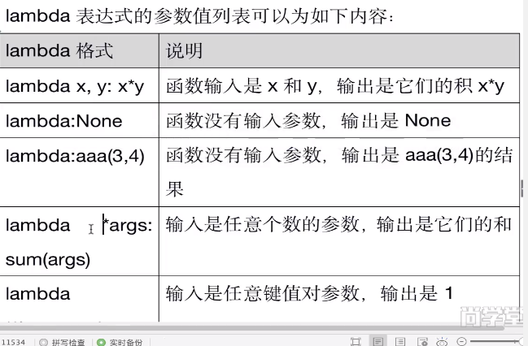
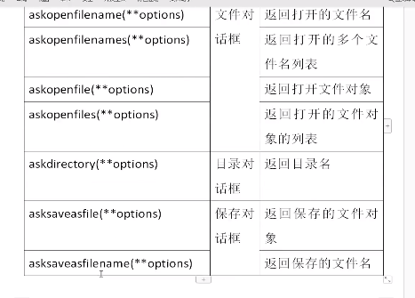

#### GUI图型界面编程
##### GUI编程整体描述
* 图形用户界面是由一个个组件组成，就像小孩“搭积木”一样最终组成了整个界面，有的组件还能在里面
放置其他组件，我们称之为“容器”

#### 常用组件列表汇总
|Tkinter类|名称|简介|
|---------|-------|------------------------------------------------|
|Toplevel|顶层|容器类，可用于为其他组件提供单独的容器类；Toplevel有点类似于窗口|
|Button|按钮|代表按钮组件|
|Canvas|画布|提供绘图功能，包括直线、矩形、椭圆、多边形、位图等|
|Checkbutton|复选框|可供用户勾选的复选框|
|Entry|单行输入框|用户输入内容|
|Frame|容器|可用于装载其他的GUI组件|
|Label|标签|用于显示不可编辑的文本或图标|
|LabelFrame|容器|也是容器组件，类似Frame,但它支持添加标题|
|Listbox|列表框|列出多个选项，供用户选择|
|Menu|菜单|菜单组件|
|Menubutton|菜单按钮|用来包含菜单的按钮（包括下拉式、层叠式等）|
|OplionMenu|菜单按钮|Menubutton的子类，也代表菜单按钮，可通过按钮打开一个菜单|
|Message|消息框|类似于标签，但可以显示多行文本|

#### Label标签
* Label(标签)主要用于显示文本信息，也可以显示图像
##### Label（标签）有这样一些常见属性：
* width、height:用于指定区域大小，如果显示是文本，则以单个英文字符大小为单位（一个汉字站2个字符位置）；如果显示是图像
，则以像素为单位，默认值是根据具体显示的内容动态调整
* font:制定字体和字体大小，如：font=(font_name,size)
* image:显示在Label上的图像，目前tkinter只支持gif格式
* fg和bg:fg(foreground):前景色、bg(background):背景色
* justify:针对多行文本的对齐，可设置justify属性，可选值“left”、“center”、“right”

#### Options选项
###### 我们可以通过三种方式设置Options选项，这在各种GUI用法都是一致的
* 创建对象时，使用命名参数（也叫关键字参数）

        fred=Button(self,fg="red",bg="blue")
* 创建对象后，使用字典索引方式

        fred["fg"]="red"
* 创建对象后，使用config()方法

        fred.config(fg="red",bg="blue")
        
#### Text多行文本框
* Text(多行文本框)的主要用于显示多行文本，还可以显示网页链接，图片，HTML页面，甚至Css样式表，添加组件等
，因此，也常常被当做简单的文本处理器、文本编辑器或者网页浏览器来使用。比如LDLE就是Text组件

#### Radiobutton 单选按钮
* Radiobutton 控件用于选择同一组单选按钮中的一个
* Radiobutton 可以显示文本、也可以显示图像
* Radiobutton基础用法

        from tkinter import *
        from tkinter import messagebox
        
        class Application(Frame):
#### Checkbutton 复选按钮
* Checkbutton控件用于选择多个按钮的情况，Checkbutton可以显示文本，也可以显示图像
* Checkbutton 复选按钮用法
    
        from tkinter import *
        from tkinter import messagebox
        
        class Application(Frame):
            def __init__(self,master=None):
                super().__intt__(master)
                self.master=master
                self.pack()
                self.createWidget()

#### canvas画布
* canvas（画布）是一个矩形区域，可以放置图形、图像、组件等

#### 布局管理器
* 一个GUI应用程序必然有大量的组件，tkinter提供的布局管理器帮助我们组织、管理
* 在父组件中子组件的布局方式，tkinter提供了三种管理器：pack\grid\place

##### grid布局管理器
* grid表格布局，采用表格结构组织组件。子组件的位置由行和列的单元格来确认，并且可以跨行
和跨列，从而实现复杂的布局
* grid()方法提供的选项

|选项|说明|取值范围|
|--------|:-----------------|:---------------------------------------|
|column|单元格的列号|从0开始的正整数|
|columnspan|跨行，跨越的列数|正整数|
|row|单元格的行号|从0开始的正整数|
|rowspan|跨行，跨越的行数|正整数|
|ipadx、ipady|设置子组件之间的间隔，x方向或者y方向，默认单位为像素|非负浮点数，默认0.0|
|padx,pady|与之并列的组件之间的间隔，x|方向或者y方向，默认单位为像素|非负浮点数，默认0.0|
|sticky|组件紧贴所在单元格的莫一角，对应与于东南西北中以及四个角|n\s,w,e,n,w,sw,se,ne,,,|

#### place布局管理器
* place布局管理器可以通过坐标精确控制组件的位置，适用于一些布局更加灵活的场景
* palce（）方法的选项

|选项|说明|取值范围|
|-------|-------------|-------------------------|
|x,y|组件左上角的绝对值坐标（相对于窗口）|非负整数；x和y选项用于设置偏移（像素）；如果同事设置relx(rely)和x(y),那么palece
将优先计算relx和rely，然后子啊实现x和y指定的偏移值|
|relx rely|组件左上角的坐标（相对父容器）|relx是相对父组件的位置，0是最左表，0.5是正中间，1是最右边
rely是相对父组件的位置，0是最上边，0.5是正中间,1是最下边|
|width height |组件的宽度和高度|非负整数|
|relwidth,relheight|组件的宽度和高度（相对与父容器）|与relx,rely取值类似，但是相对于父组件的尺寸|
|anchor|对齐方式，左对齐“w”|n,s,w,e,nw,sw,se,ne,center(默认)|

#### 事件处理
* 一个GUI应用整个生命周期都处在一个消息循环（eventloop）中，它等待事件的发生，并作出相应的处理
* Tkinter提供了以处理相应的事件的机制，处理函数可被绑定给各个控件的各种事件

        widget.bind(event,handler)
* 如果相关事件发生，handler函数会被触发，事件对象event会传递给handler函数
* 鼠标和键盘事件

|代码|说明|
|--------------|-------------------------------------|
|<Button-1> <ButtonPress-1> <1>|鼠标左键按下  2表示中键 3表示右键|
|<ButtonRelease-1>|鼠标左键释放|
|<B1-Motion>|按住鼠标左键移动|
|<Double-Button-1>|双击左键|    
|<Entry>|鼠标指针进入某一组件区域|  
|<Leave>|鼠标离开某一组件区域|  
|<MouseWheel>|滚动滑轮|  
|<KeyPress-a>|按下a键，a可以用其他键代替|  
|<KeyRelease-a>|释放a键|  
|<KeyPress-A>|按下A键|  
|<Alt-KeyPress-a>|同时按下alt和a;alt可用ctrl和shift代替|  
|<Double-KeyPress-a>|快速按两下a|  
|<Control-V>|CTRL和V键被同事按下，V可以换成其他键位| 

* event对象常用属性

    
#### lambda表达式详解
* lambda表达是定义的是一个匿名函数，只适合简单输入参数，简单计算返回结果，不适合功能复杂情况

        lambda 参数值列表：表达式
     
    
#### 多种事件绑定方式汇总
##### 组件对象绑定
* 通过command属性绑定（适合简单不需要获取event对象）

        Button(root,text="登录“，command=login)
* 通过bind()方法绑定（适合需要获取event对象）

        c1=Canvas();
        c1.bind("<Button-1>",drawLine)
##### 组件类的绑定
* 调用对象的bind_class函数，将该组件类所有的组件绑定事件

        w.bind_class("Widget","event",eventhanler)       
   
#### OptionMenu选择项
* OptionMenu(选择项)用来做多选一，选中的项在顶部显示，显示效果如下：

#### Scale移动滑块
* Scale(移动滑块)用于制定的数值区间，通过滑块的移动来选择值

#### 颜色选择框
* 颜色选择框可以帮助我们设置北京颜色、前景色，画笔颜色、字体颜色等等

#### 文件对话框

#### 简单输入对话框
* simpledialog(简单对话框)包含如下常用函数
* ～

|函数名|说明|
|-----------------|------------|
|askfloat(title,prompt,**kw)|输入并返回浮点数|
|askinteger(title,prompt,**kw)|输入bong返回整数|
|sakstring(title,prompt,**kw)|输入并返回字符串|

* 参数中，title表示窗口标题，prompt是提示信息，命名参数kw为各种选项。initialvalue(初始值)
、 minvalue(最小值)、maxvalue(最大值)

#### 通用消息框

/home/redorange/workspace/2020WinterHoliday/数据结构与算法/20200131Class/project/画图软件.py

