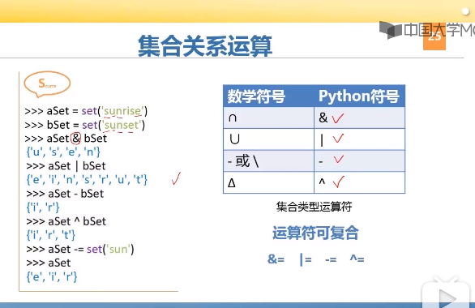
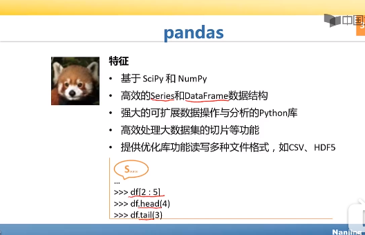
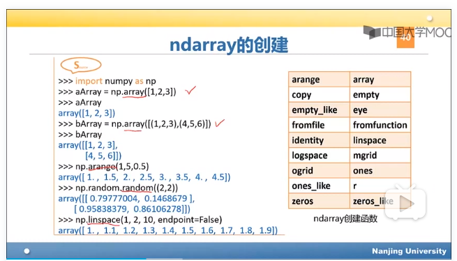
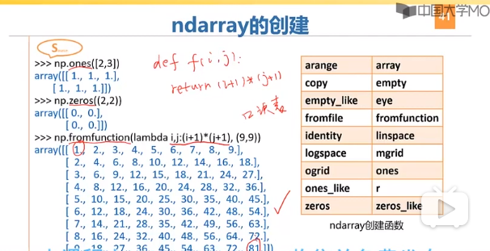

#### 集合～一个无需不重复元素的组合
* 可变集合（set）
* 不可变集合（frozenset）

        >>> bSet=set("hello")
        >>> bSet
        {'h', 'o', 'l', 'e'}
        >>> type(bSet)
        <class 'set'>
        >>> aSet=frozenset("hello")
        >>> aSet
        frozenset({'h', 'o', 'l', 'e'})
        >>> type(aSet )
        <class 'frozenset'>
#### 集合的比较
*  in、not in、 == 、 ！= 、 < 、>、 <= 、>= 
* 
#### 集合内建函数
* 面向所有集合
|函数|功能|
|:--------:|:---------------------------------:|
|s.issubset(t)|s是不是t子集|
|issuperset(t)|超集|
|union(t)||
|intersection||
|s.difference(t)|s与t不同的元素|
|symmetric_difference(t)||
|copy()||
        
        
#### Scipy
##### 特征
* 基于Python的软件生态系统
* 开源
* 主要为数学、科学和工程服务
        
##### Numpy
* 强大的ndarray对象和ufunc函数
* 精巧的函数
* 比较适合线性代数和随机数处理等科学计算
* 有效的通用多维数据，可定义任意数据类型
* 无缝对接数据库

##### ScriPy核心库
* Python中的科学计算程序的核心包
* 有效计算numpy矩阵，让NumPy和ScriPy协同工作
* 致力于科学计算中常见问题的各个工具箱，其不同子模块有不同的应用，如插值、积分、优化和图像处理等

##### pandas

        
#### Python中的数组
##### 形式
###### 用lsit和tuple等数据结构表示数组
* 一维数组 list=[1,2,3,4]
* 二维数组 list=[[1,2,3],[4,5,60],[7,8,9]]
###### array模块
* 通过array函数创建数组，array.array("B",range(5))
* 提供append、insert和read等方法
   
#### ndarray基本概念
* 维度(dimensions)称为轴（axis）,轴的个数称为秩（rank）
##### 基本属性
* ndarray.ndim(秩)
* ndarray.shape(维度)
* ndarray.size(元素的总个数)
* ndarray.dtype(元素类型)
* ndarray.itemsize(元素字节大小)

#### ndarray的创建     
        
    

### Series
#### 基本特征
* 类似一维数组
* 由数据和索引组成
   
        
        
        
        
        
        
        
        
        
        
        
        
        
        
        